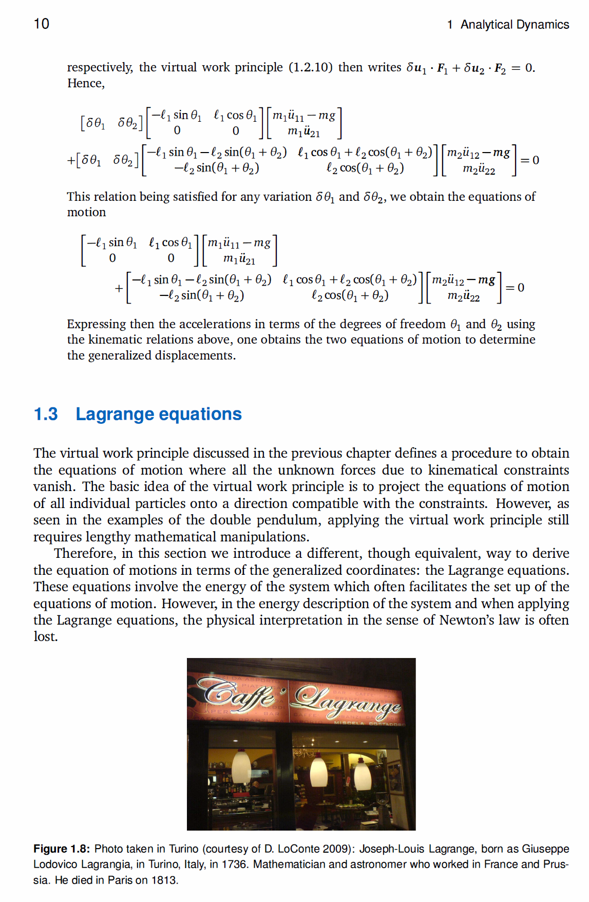

# SciTrans
创建日期 2023-06-29
目前来说有一个简单的想法，分为以下几个步骤  
*图片指文稿截图，插图指的是文稿中的插图，以作区分*  
## 1. pdf单个页面的图片区域和文字区域区分  
类似于pdf软件的编辑pdf功能ocr会出现的结果，插图单独从文字中分离出来  
**可能出现的问题***其实是一定出现的问题*：   
### 问题1  
最为简单的情况下如下图  
  
文档图片中插图只是类似于照片，不包含可能被pdf软件识别出的文字  
问题是下面这个  
  
这种坐标系中的与文档字体接近的文字，会被识别出来  
需要的解决方案是把插图整体与文字分割开来  
**好消息是我们后面要用的mathpix好像会直接无视掉插图（乐**  
但还是要区分  

### 问题2  
页眉，页脚，小注  
感觉没啥太好办法，但是基本上一本书中的这个格式是相同的，直接在处理前人工裁剪吧，目前是这么蠢的办法了  

### 问题3  
如何把切割下来的插图和插图标注对应上，因为在latex中实际上可以给图片直接生成label  
```latex
\begin{figure}
  \centering
  \includegraphics[width=0.5\textwidth]{your_image_file.png}
  \caption{这是插图的标题}
  \label{fig:example}
\end{figure}
```
如果我们在这一步把插图和插图的标题对应上，那么我们在翻译完成后可以直接把图片再插入回标题的位置，关键还是要获取插图的位置和标题的位置，以及考虑是否要把标题从翻译的文本中裁剪出去  

说的很复杂但其实想要的效果很简单，可以参见SamplePage文件夹下两张示例图片分别的CroppedResults(*我手裁的*)  


### 问题4  
小节标题，先不管了，当正文处理  

## 2.文字区域图片转latex  
我氪金了，mathpix太好用了，还有现成的api。网上自己训练的模型基本没有什么能打得过的，还有一个不氪金的办法就是邮箱轰炸latexlive，识别准确里也很高，每天限免40个   
有一个repo是im2latex还挺火的，效果不错，但不能让人满意[im2latex](https://github.com/kingyiusuen/image-to-latex), 但repo owner自己后面也说他觉得mathpix真香  
但是他的pdf转换有点难用，问题主要出在小节标题上  

## 3.latex翻译  
前一段在用ChatGPT的时候发现他竟然能输出公式，并且直接就是latex格式的，这也是我这个项目的思路启发点吧，现在的想法就是把文稿图片识别生成的latex文本直接丢给chatgpt，让他去翻译，并且保留latex格式，通过前面几次调试使其稳定输出正确的代码  

想法是可以把截图下来的文稿片段和图片按照原文的顺序存档并且逐个翻译，再按照这个顺序生成latex，图片的话就是翻译图片标题也存储下来  


## 4.latex本地生成pdf  
没什么好说的，latex代码要是正确，依次输入到latex文档中然后编译pdf就可以了  

 
